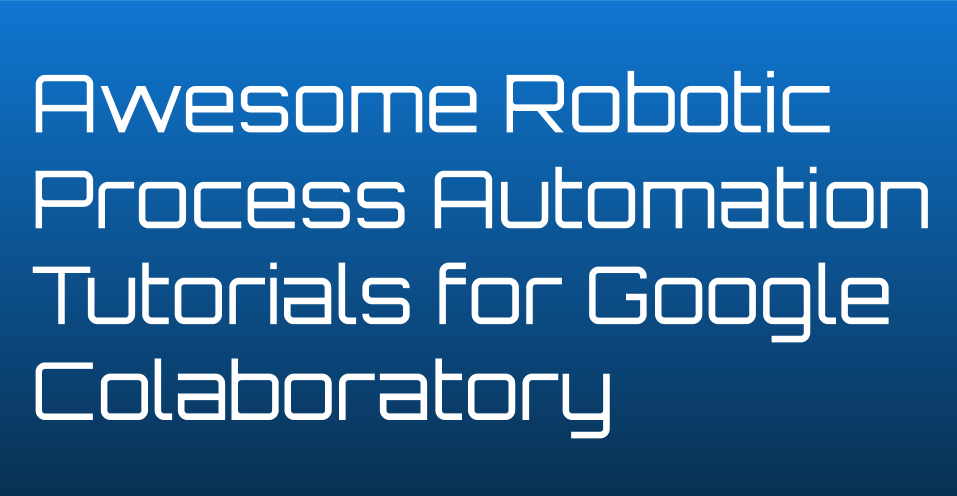

# Awesome Robotic Process Automation ( RPA ) Jupyter Notebooks for Google Colaboratory 

> A curated list of Robotic Process Automation tutorials in Jupyter Notebook format ready to run in Google Colaboratory

You can find the credits for the authors in the header of each Jupyter Notebook.

## Contents

- [RPA Basics](#rpa-basics)
- [Web Crawlers](#web-crawlers)
- [Chatbots](#chatbots)

## RPA Basics

- [RPA - Basics - Threads 1](https://www.google.com/url?q=https://colab.research.google.com/drive/1KSxL0HI1ZSXhqFpgFh2I7TVZ_y1oXywc&sa=D&ust=1571146176653000)

- [RPA - Basics - Sockets 1](https://www.google.com/url?q=https://colab.research.google.com/drive/17IUMJGxq4UkOr5VPoGIhWn0PVqtHBAhl&sa=D&ust=1571146176653000)

- [RPA - Basics - Agents 1](https://www.google.com/url?q=https://colab.research.google.com/drive/1JpWVhkVZsX-S0ijboqZVuOHKyZWsxJXt&sa=D&ust=1571146176653000)

- [RPA - Basics - Web Server 1](https://www.google.com/url?q=https://colab.research.google.com/drive/1Z7ynXcrESFaaBmhvwCPSPIJ8k2juuTpL&sa=D&ust=1571146176653000)

## Web Crawlers

- [RPA - Crawlers - Beautiful Soup 1](https://www.google.com/url?q=https://colab.research.google.com/drive/1BqPWBkA-7905qVkDxaJxkpXIqewSUPJm&sa=D&ust=1571146176654000)

- [RPA - Crawlers - Selenium 1](https://www.google.com/url?q=https://colab.research.google.com/drive/1JLtPjMaHeWn3lz3aKgJFD9eLKMt9-0Bs&sa=D&ust=1571146176654000) & [2](https://www.google.com/url?q=https://colab.research.google.com/drive/1_jkwnpbMtFYayos48tfA3o3wiftTQi2M&sa=D&ust=1571146176654000)

## Chatbots

- [RPA - Chatbots - Facebook 1](https://www.google.com/url?q=https://colab.research.google.com/drive/1sCVb14VfQYLwbqRvUzVU-RyzDgWtph9v&sa=D&ust=1571146176654000)

- [RPA - Chatbots - DialogFlow 1](https://www.google.com/url?q=https://colab.research.google.com/drive/1ts_vWaHxUQBG0dE0WwN-gN09NbW8miwn&sa=D&ust=1571146176655000)

- [RPA - Chatbots - Deep Learning 1](https://www.google.com/url?q=https://colab.research.google.com/drive/19_w26whJJMxW8sjsUp_B43ZJMzQIWWoh&sa=D&ust=1571146176655000) & [2](https://www.google.com/url?q=https://colab.research.google.com/drive/1dTwMTF9xW5xB4T8FrLlFVhEqdH4C6vfS&sa=D&ust=1571146176655000)

## Contribute

Contributions welcome! Read the [contribution guidelines](CONTRIBUTING.md) first.

## License

